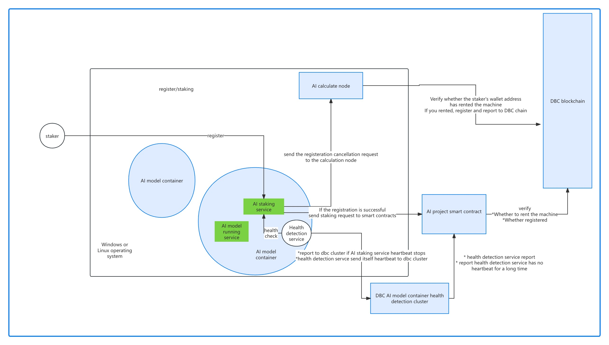
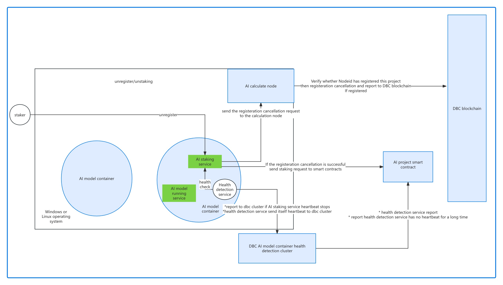

# AI Model Interface Standard Documentation

This document describes the API interface standard provided by the AI ​​model, which is provided to the distributed communication node for calling.

## Text generation text model

Chat dialogue, text assistant

- request method: POST
- request URL: http://127.0.0.1:1088/v1/chat/completions
- request Body:
```json
{
  // Model name you want to request
  "model": "Llama3-8B",
  // Preset system assistant behavior mode and alternating question and answer records
  "messages": [
    {
      "role": "system",
      "content": "You are a helpful assistant."
    },
    {
      "role": "user",
      "content": "Hello!"
    }
  ],
  // If this is set to true, the returned data will be streamed in increments of one message at a time, and the data stream ends with data: [DONE].
  "stream": false
}
```
- return example:
```json
{
  // Error code, 0 means success, non-0 means failure
  "code": 0,
  // Error message
  "message": "success",
  "created": 1677652288,
  "model": "Llama3-8B",
  // The answer given by the AI ​​model must give at least one
  "choices": [{
    "index": 0,
    "message": {
      "role": "assistant",
      "content": "Hello there, how may I assist you today?",
    },
    "finish_reason": "stop"
  }],
  "usage": {
    "prompt_tokens": 9,
    "completion_tokens": 12,
    "total_tokens": 21
  }
}
```
- streaming return example:
```
data: {"id":"cmpl-6ca706a597db48fdbfa084f61baa4771","object":"chat.completion.chunk","created":1722486241,"model":"Llama3-70B","choices":[{"index":0,"delta":{"role":"assistant"},"logprobs":null,"finish_reason":null}]}

data: {"id":"cmpl-6ca706a597db48fdbfa084f61baa4771","object":"chat.completion.chunk","created":1722486241,"model":"Llama3-70B","choices":[{"index":0,"delta":{"content":"Hello"},"logprobs":null,"finish_reason":null}]}

data: {"id":"cmpl-6ca706a597db48fdbfa084f61baa4771","object":"chat.completion.chunk","created":1722486241,"model":"Llama3-70B","choices":[{"index":0,"delta":{"content":"!"},"logprobs":null,"finish_reason":null}]}

......

data: {"id":"cmpl-6ca706a597db48fdbfa084f61baa4771","object":"chat.completion.chunk","created":1722486241,"model":"Llama3-70B","choices":[{"index":0,"delta":{"content":" discuss"},"logprobs":null,"finish_reason":null}]}

data: {"id":"cmpl-6ca706a597db48fdbfa084f61baa4771","object":"chat.completion.chunk","created":1722486241,"model":"Llama3-70B","choices":[{"index":0,"delta":{"content":"."},"logprobs":null,"finish_reason":null}]}

data: {"id":"cmpl-6ca706a597db48fdbfa084f61baa4771","object":"chat.completion.chunk","created":1722486241,"model":"Llama3-70B","choices":[{"index":0,"delta":{"content":""},"finish_reason":"stop","stop_reason":128009}],"usage":{"prompt_tokens":22,"total_tokens":68,"completion_tokens":46}}

data: [DONE]
```

```shell
curl http://127.0.0.1:1088/v1/chat/completions \
  -H "Content-Type: application/json" \
  -d '{
    "model": "Llama3-8B",
    "messages": [
      {
        "role": "system",
        "content": "You are a helpful assistant."
      },
      {
        "role": "user",
        "content": "Hello!"
      }
    ],
    "stream": false
  }'
```

## Text generation image model

Generate pictures based on prompt words

- request method: POST
- request URL: http://127.0.0.1:1088/v1/images/generations
- request Body:
```json
{
  // Model name you want to request
  "model": "SuperImage",
  // Text description prompt words for the required image
  "prompt": "A cute baby sea otter",
  // The number of images to be generated, at least one
  "n": 2,
  // The size of the image to be generated
  "size": "1024x1024",
  "width": 1024,
  "height": 1024,
  // The format in which the generated images are returned. Must be one of url or b64_json
  "response_format": "url"
}
```
- return example:
```json
{
  // Error code, 0 means success, non-0 means failure
  "code": 0,
  // Error message
  "message": "success",
  "created": 1589478378,
  // The answer given by the AI ​​model must give at least one
  "data": [
    {
      "b64_json": "",
      "url": "https://...",
      "revised_prompt": "..."
    },
    {
      "b64_json": "",
      "url": "https://...",
      "revised_prompt": "..."
    }
  ]
}
```

```shell
curl http://127.0.0.1:1088/v1/images/generations \
  -H "Content-Type: application/json" \
  -d '{
    "model": "SuperImage",
    "prompt": "A cute baby sea otter",
    "n": 1,
    "size": "1024x1024",
    "width": 1024,
    "height": 1024
  }'
```

## Image editing model

Modify images based on prompt words

- request method: POST
- request URL: http://127.0.0.1:1088/v1/images/edits
- request multipart/form-data:
  - image: Image to be edited
  - prompt: Text description prompt words for the required image
  - mask: An additional image whose fully transparent areas (e.g. where alpha is zero) indicate where image should be edited. Must be a valid PNG file, optional
  - model: Model name you want to request
  - n: The number of images to be generated, at least one
  - size: The size of the image to be generated, such as 256x256, 512x512 or 1024x1024
  - response_format: The format in which the generated images are returned. Must be one of url or b64_json
- return example:
```json
{
  // Error code, 0 means success, non-0 means failure
  "code": 0,
  // Error message
  "message": "success",
  "created": 1589478378,
  // The answer given by the AI ​​model must give at least one
  "data": [
    {
      "b64_json": "",
      "url": "https://...",
      "revised_prompt": "..."
    },
    {
      "b64_json": "",
      "url": "https://...",
      "revised_prompt": "..."
    }
  ]
}
```

```shell
curl http://127.0.0.1:1088/v1/images/edits \
  -F image="@otter.png" \
  -F mask="@mask.png" \
  -F prompt="A cute baby sea otter wearing a beret" \
  -F n=2 \
  -F size="1024x1024"
```

## Model list

A project can have multiple models. For example, DecentralGPT provides multiple models such as Llama3 70B and Qwen1.5-110B, so an interface can be provided to query the information of all models.

This interface may not be necessary. In actual deployment, the registration interface of the distributed network communication node needs to be called to inform the running model and the calling URL.

- request method: GET
- request URL: http://127.0.0.1:1088/v1/models
- return example:
```json
{
  // Project name, such as DecentralGPT, SuperImage
  "project": "xxx",
  // List of information such as the name and URL of the AI ​​model
  "data": [
    {
      "model": "Llama3-8B",
      "url": "http://127.0.0.1:1088/v1/chat/completions"
    },
    {
      "model": "Qwen1.5-110B",
      "url": "http://127.0.0.1:1088/v1/chat/completions"
    },
    {
      "model": "SuperImage",
      "url": "http://127.0.0.1:1088/v1/images/generations"
    }
  ]
}
```

```shell
curl http://127.0.0.1:1088/v1/models
```

## Registration/deregistration interface for distributed network communication nodes

When the model is running, it needs to be registered with the distributed network communication node. Only the registered model can be known and called by each node in the distributed communication network. When the model stops running, don't forget to deregister.

A project can have multiple models. The following AI model registration/unregistration interface can only operate one model at a time, while the AI ​​project registration/unregistration interface can operate multiple models at a time.

If a machine has 4 GPUs, and 4 identical models are deployed for a project, each model uses 1 GPU. At this time, the project name and model name of the 4 models are the same, and cid (Docker container ID) is needed to distinguish the 4 models. Therefore, the distributed network uses `node ID`, `project name`, `model name` and `Docker container ID` to distinguish and call different models.

### Register AI model

This interface is used to accept the registration and update of AI models and share them among distributed network nodes.

> [!NOTE]
> The AI ​​model and the registered node must be on the same machine.

- request method: POST
- request URL: http://127.0.0.1:6000/api/v0/ai/model/register
- request Body:
```json
{
  // AI project name
  "project": "DecentralGPT",
  // AI model name
  "model": "Llama3-70B",
  // HTTP Url for executing model
  "api": "http://127.0.0.1:1042/v1/chat/completions",
  // Model type, default 0
  // 0 - Text generation text model
  // 1 - Text generation image model
  // 2 - Image editing model
  "type": 0,
  // docker container ID
  "cid": "d15c4007271b"
}
```
- return example:
```json
{
  // Error code, 0 means success, non-0 means failure
  "code": 0,
  // Error message
  "message": "ok"
}
```

### Unregister AI model

This interface is used to accept the deregistration of AI models and share them among distributed network nodes.

- request method: POST
- request URL: http://127.0.0.1:6000/api/v0/ai/model/unregister
- request Body:
```json
{
  // AI project name
  "project": "DecentralGPT",
  // AI model name
  "model": "Llama3-70B",
  // docker container ID
  "cid": "d15c4007271b"
}
```
- return example:
```json
{
  // Error code, 0 means success, non-0 means failure
  "code": 0,
  // Error message
  "message": "ok"
}
```

### Register AI project

This interface is used to accept registration and update of AI projects (which can contain multiple models) and share them among distributed network nodes.

> [!NOTE]
> The AI ​​model and the registered node must be on the same machine.

- request method: POST
- request URL: http://127.0.0.1:6000/api/v0/ai/project/register
- request Body:
```json
{
  // AI project name
  "project": "DecentralGPT",
  // List of AI model and HTTP interface information
  "models": [
    {
      // Model name
      "model": "Llama3-70B",
      // HTTP Url for executing model
      "api": "http://127.0.0.1:1042/v1/chat/completions",
      // Model type, default 0
      // 0 - Text generation text model
      // 1 - Text generation image model
      // 2 - Image editing model
      "type": 0,
      // Docker container ID
      "cid": "d15c4007271b"
    }
  ]
}
```
- return example:
```json
{
  // Error code, 0 means success, non-0 means failure
  "code": 0,
  // Error message
  "message": "ok"
}
```

### Unregister AI project

This interface is used to accept the deregistration of AI projects, which will deregister all models contained in this project and share them among distributed network nodes.

- request method: POST
- request URL: http://127.0.0.1:6000/api/v0/ai/project/unregister
- request Body:
```json
{
  // AI project name
  "project": "DecentralGPT"
}
```
- return example:
```json
{
  // Error code, 0 means success, non-0 means failure
  "code": 0,
  // Error message
  "message": "ok"
}
```

## Flowchart





