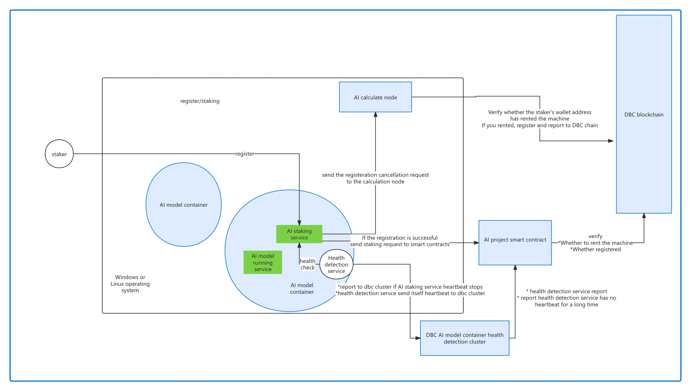
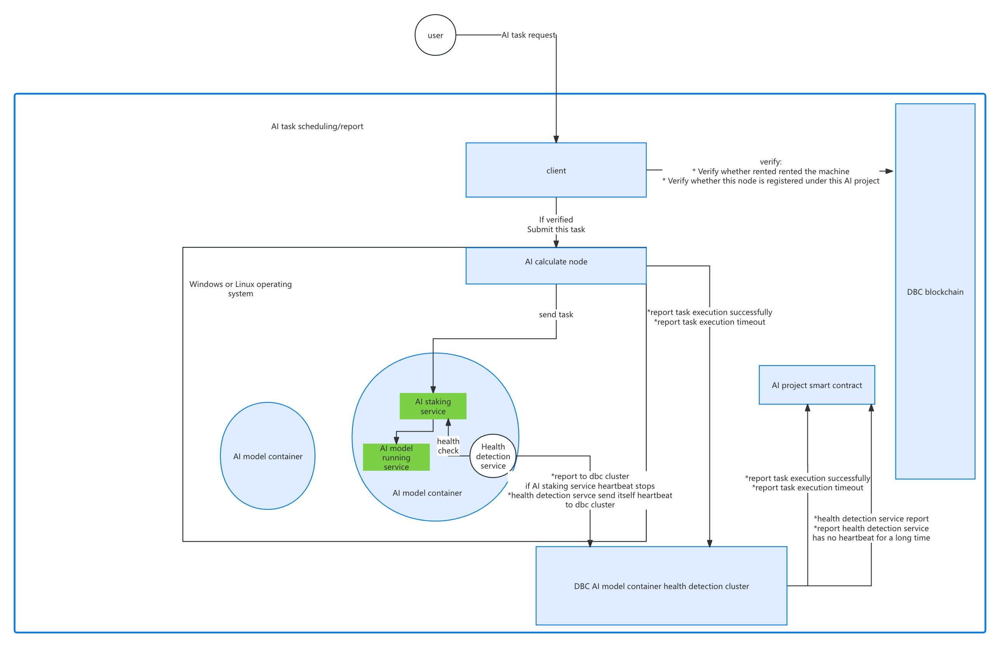
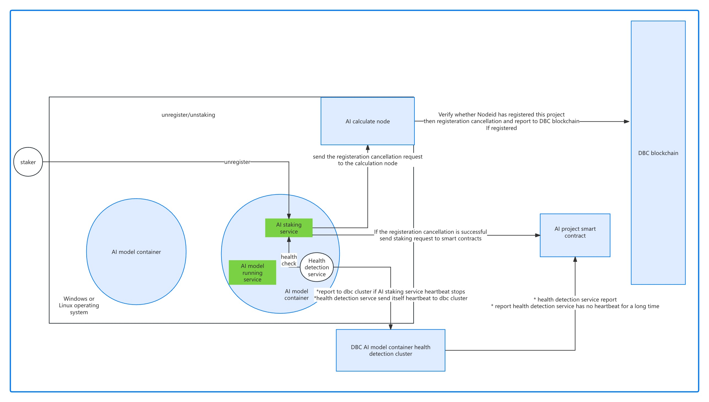

# AI 模型接口标准文档

此文档描述 AI 模型提供的 API 接口标准，提供给分布式通信节点调用。

## 文生文模型

聊天对话，文字助理

- 请求方式：POST
- 请求 URL：http://127.0.0.1:1088/v1/chat/completions
- 请求 Body：
```json
{
  // 想要请求的模型名称
  "model": "Llama3-8B",
  // 预设的系统助理行为模式和交替问答记录
  "messages": [
    {
      "role": "system",
      "content": "You are a helpful assistant."
    },
    {
      "role": "user",
      "content": "Hello!"
    }
  ],
  // 如果此项设置为 true，返回数据会将消息增量一段一段以流式传输，数据流以 data: [DONE] 结束。
  "stream": false
}
```
- 返回示例：
```json
{
  // 错误码，0 表示成功，非 0 表示失败
  "code": 0,
  // 错误信息
  "message": "success",
  "created": 1677652288,
  "model": "Llama3-8B",
  // AI 模型给出的回答，最少要给出一条
  "choices": [{
    "index": 0,
    "message": {
      "role": "assistant",
      "content": "Hello there, how may I assist you today?",
    },
    "finish_reason": "stop"
  }],
  "usage": {
    "prompt_tokens": 9,
    "completion_tokens": 12,
    "total_tokens": 21
  }
}
```
- 流式返回示例:
```
data: {"id":"cmpl-6ca706a597db48fdbfa084f61baa4771","object":"chat.completion.chunk","created":1722486241,"model":"Llama3-70B","choices":[{"index":0,"delta":{"role":"assistant"},"logprobs":null,"finish_reason":null}]}

data: {"id":"cmpl-6ca706a597db48fdbfa084f61baa4771","object":"chat.completion.chunk","created":1722486241,"model":"Llama3-70B","choices":[{"index":0,"delta":{"content":"Hello"},"logprobs":null,"finish_reason":null}]}

data: {"id":"cmpl-6ca706a597db48fdbfa084f61baa4771","object":"chat.completion.chunk","created":1722486241,"model":"Llama3-70B","choices":[{"index":0,"delta":{"content":"!"},"logprobs":null,"finish_reason":null}]}

......

data: {"id":"cmpl-6ca706a597db48fdbfa084f61baa4771","object":"chat.completion.chunk","created":1722486241,"model":"Llama3-70B","choices":[{"index":0,"delta":{"content":" discuss"},"logprobs":null,"finish_reason":null}]}

data: {"id":"cmpl-6ca706a597db48fdbfa084f61baa4771","object":"chat.completion.chunk","created":1722486241,"model":"Llama3-70B","choices":[{"index":0,"delta":{"content":"."},"logprobs":null,"finish_reason":null}]}

data: {"id":"cmpl-6ca706a597db48fdbfa084f61baa4771","object":"chat.completion.chunk","created":1722486241,"model":"Llama3-70B","choices":[{"index":0,"delta":{"content":""},"finish_reason":"stop","stop_reason":128009}],"usage":{"prompt_tokens":22,"total_tokens":68,"completion_tokens":46}}

data: [DONE]
```

```shell
curl http://127.0.0.1:1088/v1/chat/completions \
  -H "Content-Type: application/json" \
  -d '{
    "model": "Llama3-8B",
    "messages": [
      {
        "role": "system",
        "content": "You are a helpful assistant."
      },
      {
        "role": "user",
        "content": "Hello!"
      }
    ],
    "stream": false
  }'
```

## 文生图模型

根据提示词生成图片

- 请求方式：POST
- 请求 URL：http://127.0.0.1:1088/v1/images/generations
- 请求 Body：
```json
{
  // 想要请求的模型名称
  "model": "SuperImage",
  // 所需图像的文本描述
  "prompt": "A cute baby sea otter",
  // 要生成的图像数量，最少一个
  "n": 2,
  // 要生成图像的大小
  "size": "1024x1024",
  "width": 1024,
  "height": 1024,
  // 要生成图像的格式，必须是 url 或 b64_json 之一
  "response_format": "url"
}
```
- 返回示例：
```json
{
  // 错误码，0 表示成功，非 0 表示失败
  "code": 0,
  // 错误信息
  "message": "success",
  "created": 1589478378,
  // AI 模型给出的回答，最少要给出一条
  "data": [
    {
      "b64_json": "",
      "url": "https://...",
      "revised_prompt": "..."
    },
    {
      "b64_json": "",
      "url": "https://...",
      "revised_prompt": "..."
    }
  ]
}
```

```shell
curl http://127.0.0.1:1088/v1/images/generations \
  -H "Content-Type: application/json" \
  -d '{
    "model": "SuperImage",
    "prompt": "A cute baby sea otter",
    "n": 1,
    "size": "1024x1024",
    "width": 1024,
    "height": 1024
  }'
```

## 修图模型

根据提示词修改图片

- 请求方式：POST
- 请求 URL：http://127.0.0.1:1088/v1/images/edits
- 请求 multipart/form-data：
  - image: 要编辑的 PNG 图片
  - prompt: 所需图像的文本描述
  - mask: 透明遮罩的附加 PNG 图片，可选参数
  - model: 想要请求的模型名称
  - n: 要生成的图像数量
  - size: 要生成图像的大小，例如 256x256、512x512 或者 1024x1024
  - response_format: 生成图像的格式，必须是 url 或 b64_json 之一
- 返回示例：
```json
{
  // 错误码，0 表示成功，非 0 表示失败
  "code": 0,
  // 错误信息
  "message": "success",
  "created": 1589478378,
  // AI 模型给出的回答，最少要给出一条
  "data": [
    {
      "b64_json": "",
      "url": "https://...",
      "revised_prompt": "..."
    },
    {
      "b64_json": "",
      "url": "https://...",
      "revised_prompt": "..."
    }
  ]
}
```

```shell
curl http://127.0.0.1:1088/v1/images/edits \
  -F image="@otter.png" \
  -F mask="@mask.png" \
  -F prompt="A cute baby sea otter wearing a beret" \
  -F n=2 \
  -F size="1024x1024"
```

## 模型列表

一个项目可以有多个模型，例如 DecentralGPT 提供了 Llama3 70B 和 Qwen1.5-110B 等多个模型，因此可以提供一个接口查询所有模型的信息。

这个接口可能不是必要，实际部署时需要调用分布式网络通信节点的注册接口来告知运行的模型和调用的 URL。

- 请求方式：GET
- 请求 URL：http://127.0.0.1:1088/v1/models
- 返回示例：
```json
{
  // 项目名称，例如 DecentralGPT，SuperImage
  "project": "xxx",
  // AI 模型的名称和 URL 等信息的列表
  "data": [
    {
      "model": "Llama3-8B",
      "url": "http://127.0.0.1:1088/v1/chat/completions"
    },
    {
      "model": "Qwen1.5-110B",
      "url": "http://127.0.0.1:1088/v1/chat/completions"
    },
    {
      "model": "SuperImage",
      "url": "http://127.0.0.1:1088/v1/images/generations"
    }
  ]
}
```

```shell
curl http://127.0.0.1:1088/v1/models
```

## 分布式网络通信节点的注册/反注册接口

模型运行起来时需要向分布式网络通信节点注册，只有注册后的模型才能被分布式通信网络中的各个节点知晓和调用，在模型停止运行时，不要忘记反注册。

一个项目可以有多个模型，下面的 AI 模型注册/反注册接口一次只能操作一个模型，而 AI 项目注册/反注册接口一次可以操作多个模型。

假如一台机器有4个 GPU，为一个项目部署了4个相同的模型，每个模型使用1个 GPU，此时4个模型的项目名称和模型名称都一样，就需要 cid (Docker 容器 ID)来区分这个4个模型，因此分布式网络使用 `节点 ID`、`项目名称`、`模型名称` 和 `Docker 容器 ID` 区分和调用不同的模型。

### 注册 AI 模型

此接口用于接受 AI 模型的注册与更新，并将其在分布式网络节点间共享。

> [!NOTE]
> AI 模型和注册的节点必须在同一台机器上。

- 请求方式: POST
- 请求 URL: http://127.0.0.1:6000/api/v0/ai/model/register
- 请求 Body:
```json
{
  // AI 项目名称
  "project": "DecentralGPT",
  // AI 模型名称
  "model": "Llama3-70B",
  // 执行模型的 HTTP Url
  "api": "http://127.0.0.1:1042/v1/chat/completions",
  // 模型类型，默认 0
  // 0 - 文生文模型
  // 1 - 文生图模型
  // 2 - 图生图模型
  "type": 0,
  // docker 容器的 ID
  "cid": "d15c4007271b"
}
```
- 返回示例:
```json
{
  // 错误码，0 表示成功，非 0 表示失败
  "code": 0,
  // 错误信息
  "message": "ok"
}
```

### 反注册 AI 模型

此接口用于接受 AI 模型的反注册，并将其在分布式网络节点间共享。

- 请求方式: POST
- 请求 URL: http://127.0.0.1:6000/api/v0/ai/model/unregister
- 请求 Body:
```json
{
  // AI 项目名称
  "project": "DecentralGPT",
  // AI 模型名称
  "model": "Llama3-70B",
  // docker 容器的 ID
  "cid": "d15c4007271b"
}
```
- 返回示例:
```json
{
  // 错误码，0 表示成功，非 0 表示失败
  "code": 0,
  // 错误信息
  "message": "ok"
}
```

### 注册 AI 项目

此接口用于接受 AI 项目(可包含多个模型)的注册与更新，并将其在分布式网络节点间共享。

> [!NOTE]
> AI 模型和注册的节点必须在同一台机器上。

- 请求方式: POST
- 请求 URL: http://127.0.0.1:6000/api/v0/ai/project/register
- 请求 Body:
```json
{
  // AI 项目名称
  "project": "DecentralGPT",
  // AI 模型和 HTTP 接口信息列表
  "models": [
    {
      // 模型名称
      "model": "Llama3-70B",
      // 执行模型的 HTTP Url
      "api": "http://127.0.0.1:1042/v1/chat/completions",
      // 模型类型，默认 0
      // 0 - 文生文模型
      // 1 - 文生图模型
      // 2 - 图生图模型
      "type": 0,
      // docker 容器的 ID
      "cid": "d15c4007271b"
    }
  ]
}
```
- 返回示例:
```json
{
  // 错误码，0 表示成功，非 0 表示失败
  "code": 0,
  // 错误信息
  "message": "ok"
}
```

### 反注册 AI 项目

此接口用于接受 AI 项目的反注册，会将此项目包含所有模型全都反注册，并将其在分布式网络节点间共享。

- 请求方式: POST
- 请求 URL: http://127.0.0.1:6000/api/v0/ai/project/unregister
- 请求 Body:
```json
{
  // AI 项目名称
  "project": "DecentralGPT"
}
```
- 返回示例:
```json
{
  // 错误码，0 表示成功，非 0 表示失败
  "code": 0,
  // 错误信息
  "message": "ok"
}
```

## 流程图






